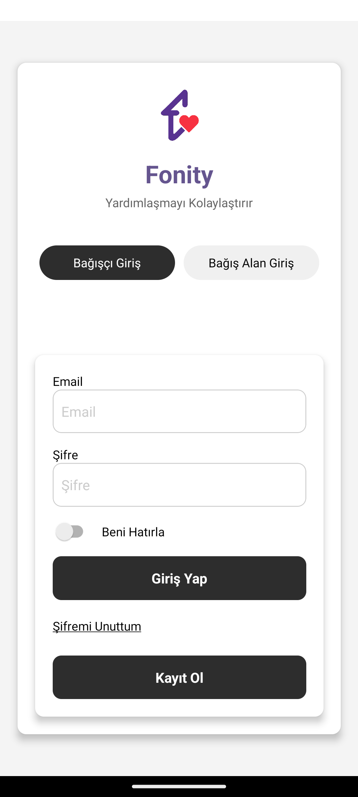
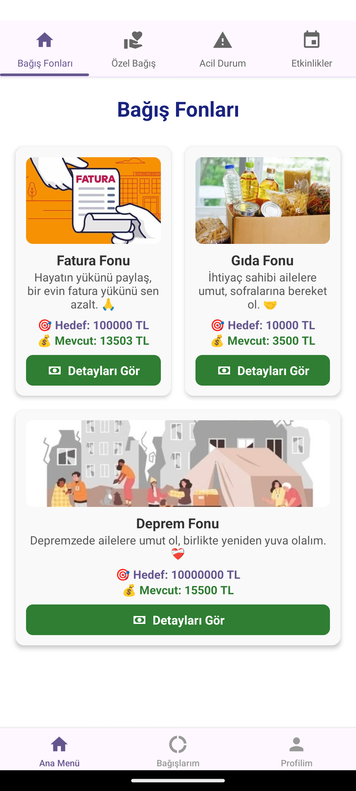
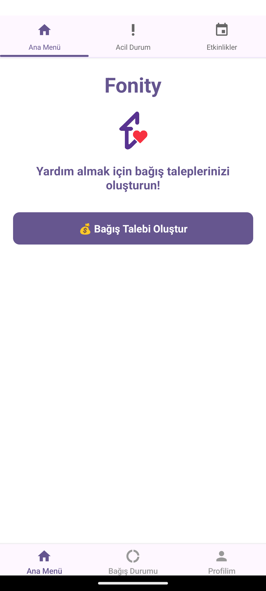
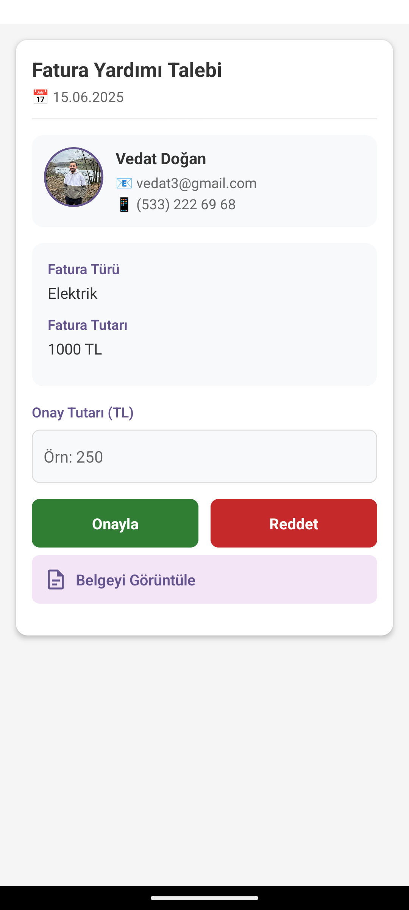
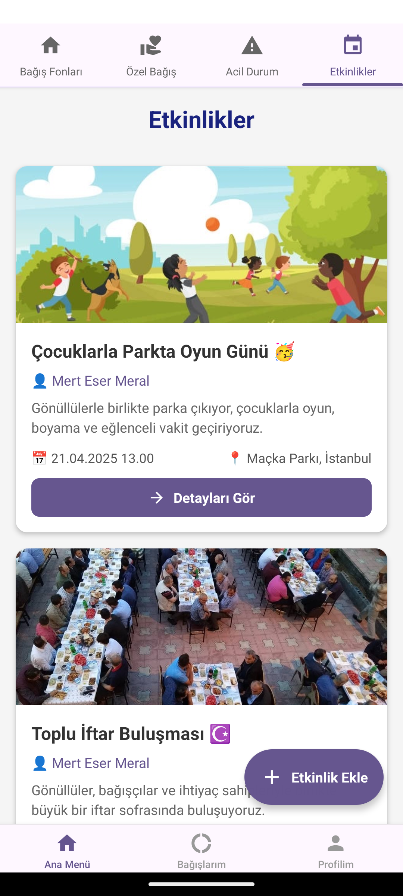
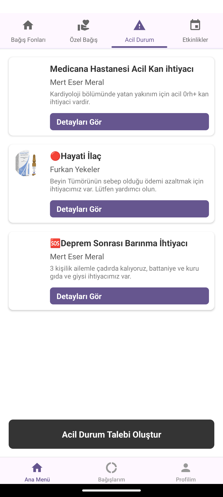

# Fonity - Dijital Bağış ve Yardım Platformu


**Fonity**, Türkiye'deki ihtiyaç sahipleri ile bağışçıları dijital bir platformda güvenli, şeffaf ve erişilebilir şekilde bir araya getiren mobil bir uygulamadır. React Native ile geliştirilen bu uygulama sayesinde sosyal dayanışma süreci dijital ortama taşınmış ve sürdürülebilir hale getirilmiştir.

## 📲 Uygulama Görselleri

| Giriş & Kayıt                                 | Bağış Fonları                               | Yardım Talebi                                    |
| ----------------------------------------------- | ----------------------------------------------- | ------------------------------------------------- |
|  |  |  |

| Talep Onaylama                                    | Etkinlikler                                      | Acil Durumlar                                       |
| ------------------------------------------------- | ------------------------------------------------ | --------------------------------------------------- |
|  |  |  |

## 🎯 Amaç ve Vizyon

Bu proje, bağışçılar ile destek arayan bireyler arasında güvenilir, izlenebilir ve kullanımı kolay bir köprü oluşturmayı hedefler:

- Bağış süreçlerini dijitalleştirmek
- Yardımların şeffaf biçimde izlenebilmesini sağlamak
- Acil durumlar ve sosyal etkinliklere hızlı erişim sunmak
- Sosyal sorumluluk bilincini yaygınlaştırmak

## 🚀 Özellikler

- 🔐 **Kullanıcı Tipi Desteği:** Bağışçı ve bağış alan olarak giriş yapma
- 📦 **Fonlar:** Gıda, fatura, eğitim gibi tematik bağış fonları
- 👤 **Kişiye Özel Yardım:** Özel yardım taleplerine birebir destek
- 🆘 **Acil Durum Modülü:** Kan, afet, sağlık gibi anlık ihtiyaç ilanları
- 🎉 **Etkinlik Modülü:** Sosyal sorumluluk odaklı faaliyet takibi
- 📈 **Bağış Takibi:** Yapılan bağışları detaylı görme
- 📎 **Belge Onayı:** Belgeli yardım talepleri ve yönetici onayı
- 💳 **Iyzico ile Güvenli Ödeme:** Kredi kartı ile doğrudan ödeme
- 🔒 **Kimlik Doğrulama:** TC Kimlik kontrolü ve Firebase Authentication
- 📬 **Geri Bildirim / İletişim** bölümü

## 🛠️ Kullanılan Teknolojiler

| Teknoloji                      | Açıklama                                 |
| ------------------------------ | ------------------------------------------ |
| **React Native**         | Mobil uygulama geliştirme                 |
| **Firebase**             | Authentication, Firestore DB, Hosting      |
| **Iyzico API**           | Güvenli bağış ödemeleri               |
| **Node.js + Express.js** | Backend servisleri ve kimlik doğrulama    |
| **Figma**                | UI/UX prototipleri                         |
| **Expo**                 | Uygulama testi ve geliştirme kolaylığı |
| **Postman**              | API testleri                               |
| **Git & GitHub**         | Sürüm kontrolü ve kaynak paylaşımı   |

## 🧱 Uygulama Mimarisi

- **Frontend:** React Native (iOS & Android destekli)
- **Backend:** Firebase Cloud Functions (Express tabanlı)
- **Veritabanı:** Firebase Realtime Database
- **Kimlik Doğrulama:** Firebase Auth + T.C. Kimlik Numarası doğrulama (SOAP/XML API)
- **Ödeme:** Iyzico API ile doğrudan bağış

## 🔐 Güvenlik

- E-posta ve parola ile giriş
- Firebase güvenlik kuralları ile veri erişim yetkilendirme
- Gerçek TC Kimlik bilgileriyle kullanıcı doğrulama
- Uçtan uca veri şifreleme (Google Cloud Default Encryption)

## 🧪 Test ve Kalite

- Kullanıcı testleri (giriş, ödeme, yardım talebi)
- Backend API unit testleri (Kimlik doğrulama, Iyzico ödeme)
- Firebase log takibi ve hata analizi

## 🌍 Sosyal Katkı & Etki

Fonity uygulaması, **Birleşmiş Milletler Sürdürülebilir Kalkınma Amaçları** kapsamında “Yoksulluğa Son” ve “Eşitsizliklerin Azaltılması” hedeflerini desteklemektedir. Proje, Türkiye Cumhuriyeti 12. Kalkınma Planı ile uyumlu sosyal yardım ve dijital dönüşüm vizyonuna katkı sunar.

## 📖 Akademik Bilgi

Bu uygulama, Sakarya Üniversitesi Bilgisayar Mühendisliği bölümünde yürütülen 2024-2025 BSM498 Bitirme Projesi kapsamında geliştirilmiştir.

- **Tez Başlığı:** İhtiyaç Sahipleri için Dijital Bağış ve Yardım Platformu
- **Hazırlayanlar:** Mert Eser Meral, Vedat Doğan
- **Danışman:** Öğr. Gör. Ahmet Şanslı
- **🏅Destek:** Bu proje, **TÜBİTAK 2209-A** Üniversite Öğrencileri Araştırma Projeleri Destekleme Programı kapsamında desteklenmiştir.
- [📄 Bitirme Tezi PDF (tıklayın)](./BSM498_BitirmeCalismasi_G211210047_G211210053_250626.pdf)

## 📥 Kurulum

```bash
git clone https://github.com/mertesermeral/bagis_app.git
cd bagis_app
npm install
npx expo start
```

> Firebase ve Iyzico entegrasyonları için `config.js` dosyasını kendi API bilgilerinizle doldurmanız gerekir.

## ✨ Katkıda Bulunun

PR’lar, hata raporları ve önerilere açığız. Daha şeffaf ve güçlü bir dijital dayanışma kültürü için siz de katkı sunun!

## 📧 İletişim

📮 mertesermeral@gmail.com

---

> “Yardımlaşmayı kolaylaştırır” – **Fonity**
